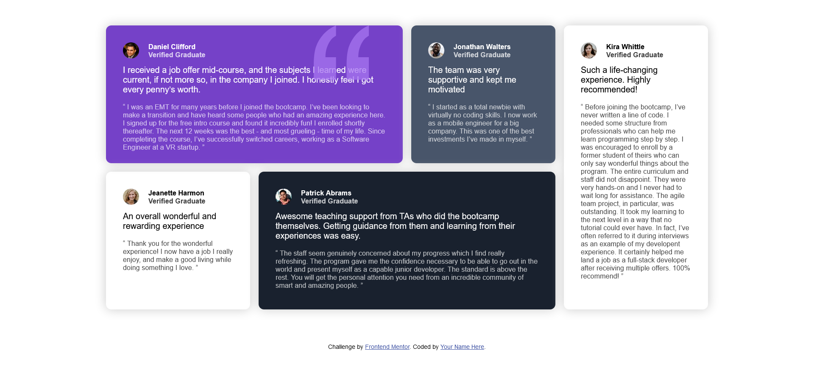

# Frontend Mentor - Testimonials grid section solution

This is a solution to the [Testimonials grid section challenge on Frontend Mentor](https://www.frontendmentor.io/challenges/testimonials-grid-section-Nnw6J7Un7). Frontend Mentor challenges help you improve your coding skills by building realistic projects.

## Table of contents

- [Overview](#overview)
  - [The challenge](#the-challenge)
  - [Screenshot](#screenshot)
  - [Links](#links)
- [My process](#my-process)
  - [Built with](#built-with)
  - [What I learned](#what-i-learned)
  - [Continued development](#continued-development)
- [Author](#author)

## Overview

### The challenge

Users should be able to:

- View the optimal layout for the site depending on their device's screen size

### Screenshot

### Links

- Solution URL: [https://github.com/AakashSahani/aakashsahani.github.io/tree/main/testimonials-grid-section-main]
- Live Site URL: [https://aakashsahani.github.io/testimonials-grid-section-main/index.html]

## My process

### Built with

- Semantic HTML5 markup
- CSS custom properties
- Flexbox
- CSS Grid
- Mobile-first workflow

### What I learned

I learned how to use mobile first development as well as how to use grid.

I want to further improve my Resonpive Design CSS.

## Author

- Website - [Aakash Sahani](https://www.aakashsahani.com)
- Frontend Mentor - [@AakashSahani](https://www.frontendmentor.io/profile/AakashSahani)
